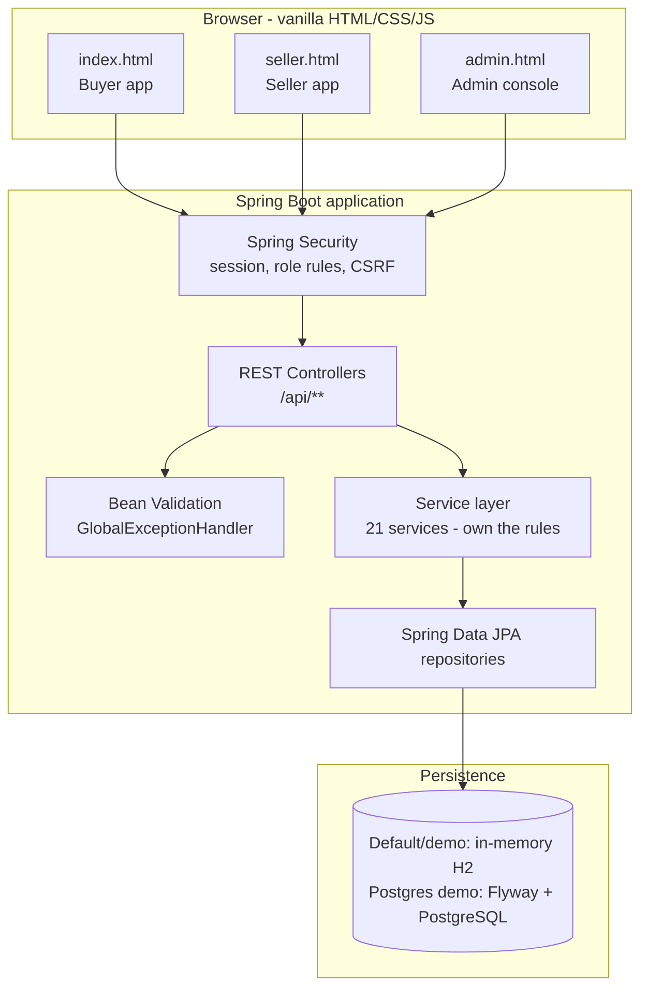
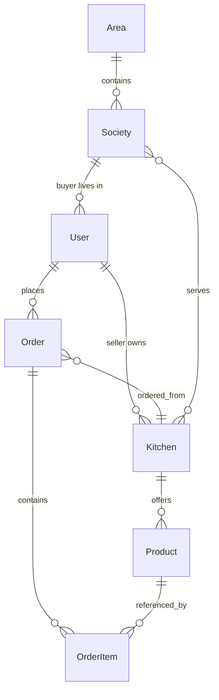

# SocioMart

**A society-level marketplace connecting buyers with home-kitchen and homemade sellers. The demo includes Buyer, Seller and Admin apps, recurring offerings, date-specific occurrence overrides, seller-recorded delivery, and an operations console.**

> **Project status:** Recurring Offerings V2 and Seller Dashboard V3 are implemented and covered by the automated suite. SocioMart remains a demo, not a production-ready service. In particular, authentication is demo-only, payments are simulated/manual, and the deployed demo uses ephemeral in-memory H2.

## 🔗 Quick Links

| | |
|---|---|
| 🌐 **Live Demo / Buyer app** | https://sociomart-demo.onrender.com/ |
| 🏪 **Seller app** | https://sociomart-demo.onrender.com/seller.html |
| 🛡️ **Admin app** | https://sociomart-demo.onrender.com/admin.html |
| 💻 **GitHub Repository** | https://github.com/utkarshnikhare/my-first-spring-api |
| 📋 **V2/V3 requirements matrix** | [requirements_matrix.md](./my-first-spring-api/requirements_matrix.md) |
| ✅ **Final requirements audit** | [FINAL-REQUIREMENTS-AUDIT.md](./docs/FINAL-REQUIREMENTS-AUDIT.md) |
| 🗃️ **PostgreSQL preparation and limits** | [Production readiness plan](./docs/PRODUCTION-READINESS-PLAN.md) |
| 🚦 **GitHub / Render release status** | [Final synchronization report](./docs/FINAL-GITHUB-RENDER-STATUS.md) |

The generated OpenAPI/Swagger route is intentionally not linked here: the demo currently allows public access to it, and that exposure must be reviewed before any production use.

---

## 📌 What is SocioMart?

SocioMart is a **society-level food and homemade-goods marketplace**.

In an apartment society a handful of residents cook and sell - one runs a home kitchen, another bakes cakes.
SocioMart gives each of them a **storefront**, and gives the neighbourhood a way to find them and order.

It is deliberately **location-first**. A buyer is never shown every seller on the platform; they see only the
storefronts that actually serve their society. An Admin defines the hierarchy first (**Area → Society**),
sellers then declare which societies they cover, and buyer discovery falls out of that intersection.

**The problem it solves:** home-scale sellers have no marketplace. They advertise informally in groups, cannot
show a catalogue or take an order reliably, and have no way to tell a neighbour "this came from me". Buyers
meanwhile have no way to discover who is cooking nearby.

**How the three sides relate:**

- **Buyer** and **Seller** meet only through the platform, and only where the seller's coverage overlaps the
  buyer's society.
- **Admin** is the operator of the marketplace: they own the location master data, decide who is allowed to
  sell, and watch what is happening across orders, delivery and value.

SocioMart ships **three separate web apps**, each a distinct static page with its own API surface:

| Page | Purpose |
|---|---|
| `index.html` | **Buyer app** - discovery, cart, checkout, orders |
| `seller.html` | **Seller app** - storefront, offerings, orders, delivery tracking |
| `admin.html` | **Admin console** - an operations console, not a debug dashboard |

---

## 🎯 Project Goal

The current goal is a **fully demonstrable, demo-safe marketplace** where every user journey can be walked
end-to-end without setup:

1. An Admin can stand up the location hierarchy and control who sells.
2. A seller can run a storefront, publish offerings and manage the orders that arrive.
3. A buyer can discover the storefronts that serve them and place a real order.
4. A seller can record delivery completion, and the buyer and Admin see that state immediately.
5. An Admin can see what is happening - traffic, orders, Recorded Order Value and what needs attention - and
   export it.

Everything is **measured from real stored data**. Where a figure cannot be genuinely captured (for example a
conversion rate with no recorded views), the UI says so rather than inventing a number.

---

## ✨ Features

- **Location-first discovery** - buyers see only storefronts serving their society
- **Three apps** - buyer, seller, admin
- **Storefronts** - a seller may run a Kitchen and/or a Homemade storefront, and serves multiple societies
- **Offerings** - today's items and pre-orders, with quantity limits and cut-offs
- **Recurring offerings** - repeat schedules with independent per-date occurrences and overrides
- **Seller Dashboard V3** - LIVE and RECURRING views with schedule-aware actions
- **Orders** - real order lifecycle, totals, and stock reservation
- **Payment status** - recorded, independent of delivery
- **Seller-recorded delivery** - per-order checkbox plus offering-level bulk completion
- **Admin operations console** - dashboard, approvals, seller/buyer management, orders, analytics
- **Areas & Societies** - master data with stable IDs, enable/disable and usage counts
- **Analytics** - genuine traffic capture, seller performance, Recorded Order Value breakdowns
- **Exports** - Orders, Sellers, Buyers, Analytics as filter-aware CSV
- **Retention** - configurable order-retention window with a guarded, opt-in purge
- **Audit trail** - append-only record of every consequential Admin action
- **Attention model** - operational items that genuinely need a decision

---

## 👥 User Roles

| Role | Main responsibilities |
|---|---|
| **Buyer** | Set their society, discover eligible storefronts, browse offerings, place orders, view order, payment and delivery status |
| **Seller** | Manage storefront(s) and service coverage, publish offerings, manage orders, record delivery completion |
| **Admin** | Operate the marketplace - approve sellers, manage sellers/buyers/orders, monitor analytics and Recorded Order Value, maintain the audit trail |
| **Super Admin** | Global scope; can additionally create and manage Admin accounts |

Roles are enforced **server-side**. `/api/admin/**` requires `ADMIN` or `SUPER_ADMIN`; `/api/superadmin/**`
requires `SUPER_ADMIN`. Hiding a menu item is never the protection.

---

## 🛒 Buyer Experience

- **Location setup** - the buyer sets their society (and Area), which drives everything they can see
- **Discovery** - only storefronts serving that society, with their offerings
- **Storefront detail** - identity, service area, social links, and offerings split into
  *Available Today* and *Pre-order*
- **Offering detail** - price per unit, quantity limits, cut-off times, pre-order date and slot
- **Cart and draft order** - items held as a draft, resumable
- **Checkout** - buyer details, payment-status selection, then confirm
- **Place order** - validates the profile, service-area coverage and remaining stock, then reserves inventory
- **Order history** - active and past orders
- **Order status** - payment status and delivery status on every order
- **Delivery visibility** - *read-only*. The buyer sees the seller's record and cannot confirm or change it
- **Favourites** - saved stores, with a per-buyer limit enforced safely under concurrency
- **Enquiries** - contact a seller about custom requests
- **Notifications** - order and payment updates
- **Simulated checkout options** - Demo UPI, Demo Card and Cash on Delivery; no real payment is processed

---

## 🏪 Seller Experience

- **Storefront / kitchen** - display name, society, building, social links, and an availability toggle that
  controls whether buyers can currently order
- **Multiple storefronts** - a seller may run a **Kitchen** and/or a **Homemade** storefront; each keeps its
  own catalogue and its own delivery state
- **Service coverage** - choose which societies the storefront serves. This is what makes it discoverable;
  a new society is **never** automatically added to existing sellers
- **Kitchen/store setup** - authenticated sellers edit the storefront profile, choose Area/Society coverage,
  and manage its public availability. Seller accounts are provisioned and moderated; this demo does not
  provide a public self-service seller sign-up flow
- **Shareable Kitchen page** - the seller's View/Preview action opens the buyer-facing
  `/#/kitchen/{id}` page, which can be shared directly
- **Offerings / items** - create, edit, price, quantity limits, sold-out, pause/resume, and republish from
  history
- **Saved templates and quick posts** - publish a repeat offering quickly; WhatsApp quick-post parsing
- **Orders** - grouped **offering → customer orders**, with a per-customer drill-down
- **Payment visibility** - record whether an order is paid; independent of delivery
- **Delivery tracking** - see the dedicated section below
- **Dashboard, earnings and history** - per-day summary and per-dish figures

---

## 🔁 Recurring Offerings and Pre-orders (V2)

The existing Create Offering flow supports one-time items and repeating schedules. A schedule stores its
weekday pattern and defaults; each selling date is materialized as a separate occurrence with its own
quantity, order window, ready/delivery time, status and order bucket.

- Choose weekdays and an end rule; **Ongoing** is capped at 90 days and can be extended.
- Blank default quantity means **No limit**.
- **Edit Today / Edit This Date** changes only that occurrence. **Manage Schedule** changes the rule and
  future defaults; it does not silently overwrite past or explicitly overridden dates.
- Per-date quantity, close-time and ready-time overrides are resolved independently. Existing orders remain
  attached to their occurrence.
- Buyers see an orderable future occurrence as a **Pre-order** with its date; checkout revalidates the
  selected date, cutoff and remaining quantity on the server.
- Seller LIVE actions operate on the selected occurrence; RECURRING is for managing schedules, not orders.

The detailed extracted V2 specification and test evidence are in
[REQ1_recurring_v2.txt](./docs/REQ1_recurring_v2.txt) and
[requirements_matrix.md](./my-first-spring-api/requirements_matrix.md). The original DOCX source is not in
this workspace, so coverage against content absent from the extracted text is not independently verified.

## 📈 Seller Dashboard (V3)

The Seller home page has three data-backed summary cards (Views Today, Followers and Total Orders), a
compact Kitchen/Store card, and only two offering tabs:

- **LIVE** is the default and shows what can be ordered now, including applicable one-time, recurring and
  pre-order items.
- **RECURRING** shows the repeating rules, defaults and next dates, with Manage Schedule / End Schedule
  actions.
- Contextual actions distinguish one-time offerings from a specific recurring occurrence. There is no
  generic pause or sold-out action on a schedule.
- Earnings are displayed as Confirmed Today, Pending Today and This Month, using stored order/payment data;
  they are not claims of marketplace revenue or settlement.

The dashboard keeps the existing Orders filters (Society, Payment and Delivery) and navigation. See the
[extracted V3 specification](./docs/REQ2_dashboard_ui_v3.txt) and the
[requirements matrix](./my-first-spring-api/requirements_matrix.md).

---

## 🚚 Seller Delivery Tracking

Delivery is **explicitly recorded by the seller**. Nothing is inferred from time, order age, readiness or
payment. If nobody records it, the order is *not delivered*.

**Order-level delivery state**

- Delivery state lives on the **existing `Order`** record - there is no separate delivery table and no
  separate delivery app
- Every active order shows a **Delivered checkbox** that **auto-saves** on change
- **Unchecked → `NOT_DELIVERED`. Checked → `DELIVERED`**
- Ticking it stores a server-side **`delivered_at`** timestamp
- Un-ticking it **clears** `delivered_at` and returns the order to `NOT_DELIVERED`
- State **persists to the database** - it survives a page reload and a session/login refresh

**Three independent, combinable filters**

Seller Orders is grouped offering → customer orders. On top of that grouping:

| Filter | Values |
|---|---|
| **Society** | the buyer society an order belongs to |
| **Payment** | payment status |
| **Delivery** | All · Delivered · Not delivered |

Any combination of the three can be applied at once.

**Progress and cancelled orders**

At the offering level the seller sees **delivered / total** and **remaining**. **Cancelled orders are
excluded from both the total and the remaining count**, so a cancelled order is never counted as pending
delivery. When every active order is delivered the offering shows a completed state.

**Mark All Delivered - "Complete Offering"**

- **One confirmation**, and the count quoted comes from the **server's own calculation** - never a guess from
  the visible rows
- Acts on **all active, non-cancelled orders for that offering** - deliberately **not** on whatever the
  current filters happen to show, so a filtered view can never be mistaken for the action's scope
- **Idempotent** - clicking twice or sending a duplicate request changes nothing extra
- Runs in a **transaction**, so it either completes or changes nothing; a failure is never reported as success
- On failure the UI **rolls back and reconciles with the server** rather than showing a false success
- A repeated bulk click on an already-complete offering is a clean no-op

**Ownership and authorisation**

Delivery APIs verify seller authentication, authorisation, order ownership and the offering/order
relationship. The seller is resolved **from the session**, never from the request body, so a seller
**cannot** mark another seller's order as delivered by editing an ID. Bulk scope resolves from the
**offering that was opened**, so a seller running several storefronts gets correct, independent progress for
each one.

**Buyer reflection**

Buyers see *Delivered* / *Not Delivered* on their orders, read-only.

**Non-goals (explicitly not implemented, by design)**

- No GPS or live delivery tracking
- No delivery-agent app
- No delivery OTP
- No route optimisation
- No proof-of-delivery photo or signature
- No buyer-side delivery confirmation

---

## 🛠️ Admin Operations Console

The Admin app is an **operations console** - built for making operational decisions, not for watching
services. Its business navigation is **Dashboard, Approvals, Sellers, Buyers, Orders, Analytics,
Areas & Societies, Exports**. Technical tools (Diagnose / Health / Console) still resolve if you have a
direct link, but are not part of the normal navigation.

### Dashboard

Real counters computed **server-side** over the selected window (**Today · Last 5 Days · Custom date**):

| Card | Meaning |
|---|---|
| **Traffic** | marketplace / storefront views captured in the window |
| **Orders** | orders placed in the window |
| **Recorded Order Value** | value of orders recorded on the marketplace |
| **Pending Approvals** | seller applications awaiting review |
| **Buyers** | total buyers, and those ordering in the window |
| **Sellers** | total sellers, approved and pending |
| **Attention Needed** | how many operational items are open right now |
| **Recent Orders** | latest orders across the platform |
| **Pending Actions** | what the Admin needs to decide |

> **Why "Recorded Order Value" and not "Revenue"?** SocioMart does not process buyer payments. This is the
> value of orders *recorded* on the marketplace, and nothing more.

### Seller management

- **Approval** - Approve · Reject · **Request Changes**; records the **approval timestamp** and the **admin actor**
- **Inspection** - identity, mobile, enabled types (Kitchen / Homemade), storefronts, service societies
- **Storefront controls** - **Pause storefront** · **Resume storefront** · **Remove storefront**
- **Seller controls** - **Suspend seller** · **Block seller** · **Unblock seller**
- **Support notes** - internal notes about a seller, never visible to the seller or buyers
- **Status and reason** - every high-impact action stores a **reason**, and the seller sees an understandable
  status explaining why they are not yet approved
- **Audit** - the seller detail includes the full Admin action history for that seller

High-impact actions **require a reason**, require **confirmation**, and **preserve history**: blocking or
removing a seller never deletes their past orders, storefronts or audit references. Blocking a seller also
takes their storefront out of buyer discovery immediately.

### Buyer management

- **Search** by **name**, **mobile**, **Area**, **Society** or **order ID**
- **Profile and location** - society, Area, building, flat
- **Orders** - the buyer's orders with payment and delivery status
- **Account status** - **Active** or **Blocked**
- **Block / Unblock** - a **reason is mandatory** and the action is **audited**
- **Support** - internal support notes for open cases

### Orders

Each order row and its detail expose: **order ID, date/time, buyer, seller, storefront, Area, Society, items,
quantity and value**, plus:

| Dimension | Values |
|---|---|
| **Payment** | Paid · Pending · Will pay later |
| **Delivery** | Delivered · Not delivered |
| **Order status** | Draft · Ordered · Confirmed · Ready · Delivered · Completed · Cancelled |
| **Category** | Kitchen / Homemade seller type |

Filters: **date, Area, Society, seller, buyer, category, payment, delivery, order status**.
Order detail includes a **status/event history** built only from timestamps the order actually stores - a
cancelled order never claims a delivery that did not happen.

### Exports

**Orders · Sellers · Buyers · Analytics**, as CSV.

- **Respect the active filters and date range** - a narrowed screen cannot download an unfiltered file
- **Include headers** and a **generation timestamp**
- **Manual download** from the Admin UI
- **CSV formula injection is neutralised** - a value that begins with `=`, `+`, `-` or `@` is prefixed so a
  spreadsheet treats it as text

### Retention

- **Configurable `retention_days`**, default **5**, changeable at runtime with no code change or migration
- **Long-lived aggregates** (a daily rollup of order count and value) and the **audit trail** always outlive
  any detailed-order purge
- **Export before purge** is supported
- The destructive purge is **off by default and never runs on a schedule**. An Admin must deliberately arm
  it, confirm, give a reason, and confirm having exported the affected rows
- Only **closed** orders (delivered or cancelled) older than the window are ever removed - an order still in
  flight is never purged, however old it is

### Support, attention and audit

- **Attention items** are derived from real state and each links to the screen that resolves it: pending
  seller approvals, changes requested, suspended sellers, paused storefronts, blocked buyers,
  **accounts with an unresolved support note**, orders not yet confirmed, and orders with payment pending
- The **audit log** records **who, what changed, the target account/store/order, old state, new state, reason
  and timestamp** for seller approval/rejection/request-changes, storefront pause/resume/remove, seller
  block/unblock, buyer block/unblock, Area and Society enable/disable, and manual operational corrections
- The audit log is **append-only** - the Admin app deliberately offers no way to edit or delete an entry

### Admin roles

**Area Admin** and **Super Admin** are supported. Scope is enforced **server-side** in the service layer, and
the acting Admin is resolved from the **session, never from a request parameter**, so a crafted request
cannot widen an Area Admin's scope. Super Admin retains global scope.

---

## 📍 Areas & Societies

Locations are modelled as a two-level hierarchy: **Area → Society**.

- **Master records** - Admin creates and renames Areas and Societies
- **Stable IDs** - referenced by users, storefronts and orders, so relationships survive renames
- **Enable / disable** - a location can be deactivated without deleting it; disabling never hard-deletes a
  referenced location and never re-points sellers
- **Usage counts** - how many buyers and storefronts reference each location
- **Seller coverage** - a storefront declares which societies it serves. Creating a new Society does **not**
  automatically make it served by existing sellers; coverage stays an explicit seller opt-in
- **Buyer location** - the buyer's Area and Society determine what they can discover

---

## 📊 Analytics

Analytics are computed from **events the application actually records**. Nothing is estimated.

**Traffic**
- Marketplace views
- **Storefront views**
- **Offering (product) views**
- **Conversion** - orders ÷ storefront views, shown **only where views are genuinely captured**, never faked

**Commerce**
- Order count
- **Recorded Order Value**, with **average order value**
- Breakdowns of Recorded Order Value by **seller**, by **Area** and by **Society**, derived from the same
  filtered rows as the total so the parts reconcile with the whole

**Seller performance** - a **sortable** table per seller with orders, recorded value, average order value,
storefront views, offering views and conversion.

**Enquiries** - homemade enquiry counts are included.

**Events captured** - `MARKETPLACE_VIEW`, `HOMEMADE_STOREFRONT_VIEW`, `PRODUCT_VIEW`, `ORDER_PLACED`, `ORDER_NOW_CLICK`, `PAYMENT_STATUS`, `ORDER_DELIVERED`, `ORDER_CANCELLED`, `ENQUIRY_SUBMITTED`, `ENQUIRY_CLICK`, `MENU_VIEW`, `USER_REGISTERED`, `USER_LOGIN`, `SELLER_REGISTERED`, `SELLER_APPROVED`.


---

## 📦 Orders

- An order belongs to a **buyer** and a **storefront** (kitchen), with one or more **items**
- Each item captures the offering, the quantity and the **unit price at the time of ordering**, so historical
  order values never change when a seller later re-prices an offering
- **Totals** are recalculated server-side from the items
- **Inventory** is reserved when the order is placed and restored when it is cancelled
- **Payment status** and **delivery status** are independent facts
- **Order status** moves through `ORDERED → CONFIRMED → READY → DELIVERED → COMPLETED`; `CANCELLED` is a
  terminal branch and `DRAFT` is the pre-order state. **Delivery** is recorded separately and does not by
  itself advance the order status
- Placing an order is **idempotent against double submission** - a repeated request will not create a second
  order or decrement stock twice
- **Cancellations** restore inventory exactly once, even on a repeated cancel request
- Price immutability, service-area coverage and profile completeness are all enforced at placement time

---

## 🏗️ Architecture



**Layer by layer**

| Layer | Responsibility |
|---|---|
| **Frontend** | Three static HTML/CSS/JS apps served from `src/main/resources/static`. No UI framework, no build step |
| **Controllers** | 15 REST controllers under `/api/**`. Validate input, delegate, shape the response |
| **Services** | 22 services. Own business rules, transactions and authorisation checks |
| **Repositories** | Spring Data JPA repositories over the entity model |
| **Persistence** | In-memory H2 for default/demo; file H2 for dev/prod; opt-in PostgreSQL/Flyway preparation |
| **Security** | Session authentication, role rules, CSRF via a JS-readable cookie |
| **Error handling** | A single `GlobalExceptionHandler` produces one consistent error shape |
| **Tests** | JUnit 5 + Spring Security Test; latest local verification: 589 tests, 1 skipped |
| **CI** | GitHub Actions running `mvn -B clean verify` |
| **Deployment** | Render, Docker runtime, `demo` profile |

**Technology stack**

| Concern | Technology |
|---|---|
| Language | **Java 21** |
| Framework | **Spring Boot 4.1.1** |
| Web / MVC | `spring-boot-starter-webmvc` |
| Security | `spring-boot-starter-security` - session auth, role rules, CSRF |
| Persistence | `spring-boot-starter-data-jpa` (Hibernate) |
| Validation | `spring-boot-starter-validation` (Jakarta Bean Validation) |
| Database | **H2** for default/demo/dev/prod configurations; isolated `postgres-demo` profile prepared but not deployed |
| API docs | **springdoc-openapi 3.1.0**; Swagger is enabled in the demo and should be restricted before production |
| H2 console | `spring-boot-h2console` |
| Frontend | **Vanilla HTML / CSS / JavaScript** - no framework, no bundler, no build step |
| Tests | **JUnit 5**, `spring-boot-starter-test`, `spring-security-test` |
| Build | **Maven** (wrapper included), Docker multi-stage build |
| CI / hosting | **GitHub Actions**, **Render** (Docker, free plan) |

**Request flow**

```text
Browser -> Spring Security filter chain -> Controller (validate)
        -> Service (business rules, authorisation, transaction) -> Repository -> H2
```

Responses travel back the same way and always use the same error shape.

**Access and security model**

- Session-based authentication; the acting user is resolved from the session, **never** from a request body
- `/api/admin/**` requires `ADMIN` or `SUPER_ADMIN`; `/api/superadmin/**` requires `SUPER_ADMIN`
- A `PasswordEncoder` (BCrypt) bean is configured, but **no password is stored or verified** - see
  [Current Demo Limitations](#%EF%B8%8F-current-demo-limitations)
- CSRF protection using a JS-readable cookie echoed back in `X-XSRF-TOKEN` - **disabled in the demo profile only**
- Ownership is re-derived server-side for every sensitive action (orders, delivery, admin operations), so a
  client-supplied ID can never widen access
- Admin **Area Admin** scope is applied in the service layer, not in the UI

---

## 🗂️ Project Structure

```text
.
├── README.md
├── render.yaml                 # Render blueprint (Docker service, autoDeploy: false)
├── Dockerfile
├── .github/workflows/ci.yml    # CI Build Verification
├── Makefile, start.sh, start.cmd, start.ps1
└── my-first-spring-api/        # the Maven application
    ├── pom.xml
    └── src/
        ├── main/
        │   ├── java/com/example/my_first_spring_api/
        │   │   ├── controller/    # REST controllers
        │   │   ├── service/       # business rules
        │   │   ├── repository/    # Spring Data JPA repositories
        │   │   ├── model/         # JPA entities and enums
        │   │   ├── dto/           # request/response DTOs
        │   │   ├── security/      # authorization filter
        │   │   └── exception/     # error types + GlobalExceptionHandler
        │   └── resources/
        │       ├── application*.properties   # default / demo / dev / prod
        │       └── static/
        │           ├── index.html, seller.html, admin.html
        │           ├── css/     # styles.css, seller.css, admin.css
        │           └── js/      # app, buyer, common, seller, admin, config
        └── test/java/.../          # JUnit 5 tests; see latest results below
```

**Files worth knowing**

| File | Why it matters |
|---|---|
| `service/AdminService.java` | The Admin console backend - dashboard, filters, approvals, audit, retention, Area Admin scope |
| `service/OrderService.java` | Order lifecycle, totals, inventory and **delivery state** |
| `service/RecurringScheduleService.java` | Recurring schedules, occurrences, per-date overrides and extension rules |
| `service/RetentionService.java` | Configurable retention window and the guarded purge |
| `service/KitchenVisibility.java` | The single source of truth for "is this storefront publicly active" |
| `static/js/admin.js` | The whole Admin console frontend |
| `static/js/seller.js` | The Seller app, including delivery filters and bulk completion |

---

## 🗄️ Data / Domain Model

| Object | What it represents |
|---|---|
| `User` | A buyer, seller, admin or super admin - role, society/Area references, approval status, block state, Area Admin scope |
| `Area` | Top-level location grouping |
| `Society` | A society inside an Area; the unit buyers identify themselves by |
| `Kitchen` | A **storefront** - seller, `SellerType`, service areas, served societies, availability |
| `Product` | An **offering** - price, quantity limits, lifecycle state, availability |
| `Order` | A buyer order - totals, payment status, order status and **delivery state** |
| `OrderItem` | A line - offering, quantity, occurrence/date, and unit price captured at order time |
| `RecurringSchedule`, `Occurrence`, `OccurrenceOverride` | Repeating defaults, one selling date, and date-specific field overrides |
| `OrderDailyAggregate` | Long-lived daily rollup that outlives any detailed-order purge |
| `AdminAuditLog` | Append-only record of every consequential Admin action |
| `AnalyticsEvent` | Traffic and lifecycle events used to compute real analytics |
| `Enquiry`, `Favourite`, `NotificationEvent`, `LedgerEvent` | Enquiries, saved stores, notifications, ledger entries |
| `PlatformSetting` | Runtime configuration such as the retention window |
| `SellerTemplate`, `QuickPost` | Saved offering templates and quick posts |

Key enums: `UserRole`, `SellerApprovalStatus`, `OrderStatus`, `PaymentStatus`, `DeliveryStatus`,
`SellerType`, `EnquiryStatus`.



---

## 🔌 API Overview

Representative endpoint groups (the generated public Swagger page is not linked because it is currently
enabled on the demo and needs production hardening):

**Authentication** - `/api/auth`, `/api/seller-app`

| Method | Path | Purpose |
|---|---|---|
| `POST` | `/api/auth/demo-login` | Demo sign-in by mobile number |
| `GET` | `/api/auth/me` | Current session identity |
| `POST` | `/api/seller-app/demo-login` | Demo seller sign-in |

**Buyer** - `/api/buyer`

| Method | Path | Purpose |
|---|---|---|
| `GET` / `POST` | `/api/buyer/profile` | Read / update buyer profile and location |
| `GET` | `/api/buyer/orders` | Buyer orders with payment and delivery status |

**Locations / Discovery** (public)

| Method | Path | Purpose |
|---|---|---|
| `GET` | `/api/marketplace` | Available offerings for the buyer |
| `GET` | `/api/search` | Search storefronts / offerings |
| `GET` | `/api/kitchens` | Storefront list |
| `GET` | `/api/kitchens/{name}` | Storefront by name |
| `GET` | `/api/kitchens/id/{id}` | Storefront detail with offerings |

**Seller** - `/api/seller`, `/api/seller-app`

| Method | Path | Purpose |
|---|---|---|
| `GET` / `POST` | `/api/seller/kitchen` | Storefront read / create |
| `PUT` | `/api/seller/kitchen/{id}` | Update storefront |
| `POST` | `/api/seller/kitchen/{id}/pause`, `/resume` | Pause / resume storefront |
| `GET` | `/api/seller/societies` | Societies the seller can serve |
| `GET` | `/api/seller/coverage-options` | Coverage options |
| `GET` / `POST` | `/api/seller/products` | Offerings list / create |
| `PUT` | `/api/seller/products/{id}` | Update offering |
| `GET` | `/api/seller/orders` | Seller orders (Society / Payment / Delivery filters) |
| `GET` | `/api/seller/orders/{id}` | Single order |
| `POST` | `/api/seller/orders/{id}/acknowledge` | Seller confirms an order |

**Delivery** - `/api/seller-app`

| Method | Path | Purpose |
|---|---|---|
| `GET` | `/api/seller-app/orders/summary` | Daily order summary |
| `GET` | `/api/seller-app/orders/product/{productId}` | Offering → customer orders, with `society`, `status`, `delivery` filters |
| `PATCH` | `/api/seller-app/orders/{orderId}/delivery-status` | **Record one order's delivery** |
| `POST` | `/api/seller-app/orders/product/{productId}/mark-all-delivered` | **Complete Offering** (bulk, server-scoped) |

**Admin** - `/api/admin` (role-gated)

| Method | Path | Purpose |
|---|---|---|
| `GET` | `/api/admin/dashboard?date=` | Dashboard counters for a window |
| `GET` | `/api/admin/sellers`, `/buyers`, `/orders` | Operational lists with filters |
| `GET` | `/api/admin/sellers/{id}/detail` | Full seller record incl. storefronts, coverage, audit |
| `GET` | `/api/admin/buyers/{id}` | Buyer profile, orders, status, support notes |
| `POST` | `/api/admin/sellers/{id}/approve`, `/reject`, `/request-changes` | Approval workflow |
| `POST` | `/api/admin/sellers/{id}/suspend`, `/block`, `/unblock` | Seller status controls |
| `POST` | `/api/admin/sellers/{id}/support-note` | Internal seller support note |
| `POST` | `/api/admin/storefronts/{id}/pause`, `/resume`, `/remove` | Storefront controls |
| `POST` | `/api/admin/buyers/{id}/block`, `/unblock` | Buyer account control |
| `GET` | `/api/admin/orders/{id}` | Order detail incl. status history |
| `GET` | `/api/admin/analytics` | Analytics incl. seller performance |
| `GET` | `/api/admin/recorded-order-value` | Total, average and Area/Society/seller breakdowns |
| `GET` | `/api/admin/attention` | Attention / pending-action items |
| `GET` | `/api/admin/exports/{domain}.csv` | CSV export (orders / sellers / buyers / analytics) |
| `GET` / `POST` | `/api/admin/retention` | Retention window read / set |
| `POST` | `/api/admin/retention/purge-enabled`, `/purge` | Arm / run the guarded purge |
| `GET` | `/api/admin/audit-log` | Audit trail |
| `GET` / `PATCH` | `/api/admin/areas`, `/societies` | Location master data |

**Analytics** - `/api/analytics` - the event capture endpoint the apps post to.

### Example: record one order as delivered

```bash
curl -X PATCH "http://localhost:8081/api/seller-app/orders/42/delivery-status" \
  -H "Content-Type: application/json" \
  -b "JSESSIONID=<seller-session>" \
  -H "X-XSRF-TOKEN: <csrf-token>" \
  -d '{"deliveryStatus":"DELIVERED"}'
```

### Example: complete an offering

```bash
curl -X POST "http://localhost:8081/api/seller-app/orders/product/7/mark-all-delivered" \
  -b "JSESSIONID=<seller-session>" -H "X-XSRF-TOKEN: <csrf-token>"
```

### Example: admin dashboard for a window

```bash
curl "http://localhost:8081/api/admin/dashboard?date=today" \
  -b "JSESSIONID=<admin-session>" -H "X-XSRF-TOKEN: <csrf-token>"
```

> CSRF is only enforced outside the demo profile - see [Current Demo Limitations](#%EF%B8%8F-current-demo-limitations).

---

## 🗄️ Database Profiles and Limitations

| Profile | Database and behavior | Release status |
|---|---|---|
| Default | In-memory H2; Hibernate creates/updates schema | Local default; not durable |
| `demo` | In-memory H2 with demo seed data | Used by Render; restart can lose non-seed data |
| `dev` | File-based H2 for local development | Local-only convenience; not a production database |
| `prod` | File-based H2 with schema validation and demo seeding disabled | Not production-ready |
| `postgres-demo` | PostgreSQL, Flyway V1, Hibernate validation, no automatic demo seed | Prepared and tested, but not selected by Render or connected to a provider |

The PostgreSQL profile reads `SOCIOMART_DB_JDBC_URL`, `SOCIOMART_DB_USERNAME` and
`SOCIOMART_DB_PASSWORD`. Configure these only in an approved local/provider environment; never put values in
source control. The native PostgreSQL Testcontainers test requires Docker and is skipped when Docker is
unavailable locally.

**Live-data preservation blocker:** the current Render database is in-memory H2, remote H2 Console access is
disabled, and no complete supported export has been verified. A service restart/redeploy could lose non-seed
data. Do not deploy the PostgreSQL profile or restart the current service until an owner-controlled complete
export and restore have been verified.

---

## 🛑 Current Demo Limitations

SocioMart is a **demonstration build**. The following are deliberately out of scope, and the README does not
claim otherwise:

**Identity and access**

- **No real authentication.** Sign-in is a **demo mobile-number login**. There is **no OTP delivery**, no
  password, no email verification and no account recovery. A `PasswordEncoder` (BCrypt) bean is configured but
  **no password is ever stored or verified** - any mobile number resolves to a session.
- There is no public self-service seller account registration flow. Demo seller accounts are provisioned and
  moderated; authenticated sellers create/manage their Kitchen or Homemade storefront in the Seller app.
- **Demo endpoints are profile-gated.** `/api/auth/demo-login`, `/api/seller-app/demo-login` and the H2 console
  are only reachable when the app runs with a non-`prod` profile.
- **CSRF is disabled outside `prod` only.** Under `demo`, `dev` and the default profile
  (`!prod & (demo | dev | default)`) CSRF protection is off.
- **Session cookie is `SameSite=lax`** (not `strict`) outside `prod`.

**Commerce and money**

- Checkout shows Demo UPI, Demo Card and Cash on Delivery. These are simulated/manual demo options only;
  **no gateway, card collection or real payment processing** exists. Payment status
  (`PENDING` / `PAID` / `WILL_PAY_LATER`) is not proof of settlement.
- This is why the dashboard says **Recorded Order Value** rather than revenue.

**Delivery**

- Delivery is **recorded by the seller only**. There is **no GPS or live tracking, no delivery-agent app, no
  delivery OTP, no route optimisation, and no proof-of-delivery photo or signature**. The buyer sees delivery
  state **read-only** and cannot confirm it.

**Data and infrastructure**

- **In-memory H2** (`jdbc:h2:mem:sociomartdb`), re-seeded on **every boot**. Nothing persists across a restart;
  demo data is regenerated each time. The `postgres-demo` profile is migration preparation, not a live or
  production database.
- The `prod` profile points at **file-based H2 with `ddl-auto=validate`** and is **not production-ready**.
- H2 Console is local/demo-only and disabled by the PostgreSQL profile. Do not expose it to the public internet.
- No production backup/restore or persistent database has been selected or verified.

**Deployment**

- Render runs the **`demo` profile** with **`autoDeploy: false`** (see `render.yaml`). A merge to `main`
  therefore **does not deploy anything by itself** - a deploy is an explicit manual action.
- Existing service `sociomart-demo` is on Render's **Free** plan. Its last verified deployment is
  `d9bb8782ff58719a68df01236c09e9e0990c5bf4` (deployment `dep-db4i1rqj9qps73alfiug`), matching GitHub
  application code at the time of verification. GitHub `main` later advanced through documentation-only
  PRs #15 and #16 to `b70d13239776fc9221dfa6dfdca0de1910afd982` at the audit snapshot; runtime source is
  unchanged, so no redeploy was needed.
  The owner authorized loss of disposable non-seed demo records for that deployment; seeded demo data was
  available afterward.
- The demo uses ephemeral in-memory H2. A restart/redeploy can erase non-seed data; do not treat the
  deployed demo as persistent storage. No PostgreSQL database or paid resource is provisioned.

---

## 🔁 CI, GitHub and Render Deployment

**CI - the authoritative gate**

`.github/workflows/ci.yml` (**CI Build Verification**) runs on every push and pull request targeting `main`:

1. Checkout, then set up **JDK 21** (Temurin) with the Maven cache
2. `mvn -B clean verify` in `my-first-spring-api` - the full suite is the gate
3. Assert that `target/classes` and a packaged jar were actually produced

A red CI means the build did **not** pass, regardless of local results.

**Delivery model**

Work lands on a feature branch, is reviewed through a **pull request into `main`**, and is merged only once CI
is green. Completed branches stay in history - they are **not** deleted after merge.

**Render - deployed manually, on purpose**

`render.yaml` defines the `sociomart-demo` web service as a **Docker** runtime on the **free** plan, with
`SPRING_PROFILES_ACTIVE=demo` and `healthCheckPath: /api/kitchens`.

> **`autoDeploy: false`** - Render is deliberately **not** wired to GitHub pushes. A merge to `main` therefore
> **does not deploy anything by itself**. This is intentional: with auto-deploy enabled, Render shipped every
> pushed commit whether or not CI passed, so a failing test could still reach production. Deployment is now an
> **explicit manual action taken after CI is green**.

Note that editing `render.yaml` does not change an already-running deployment; it governs future deploys.

**Future production work** - real authentication, a payment provider, a persistent database, secret management
and a genuine delivery-tracking story would all need to be built before this could carry real users.

---

## 🧪 Testing

```bash
cd my-first-spring-api
.\mvnw.cmd clean verify
```

**Latest local result** (`.\mvnw.cmd -B clean verify`, 2026-10-09)

```text
Tests run: 589, Failures: 0, Errors: 0, Skipped: 1
BUILD SUCCESS
```

The skipped test is the native PostgreSQL Testcontainers case when Docker is unavailable locally; the H2
PostgreSQL-mode migration/schema validation runs locally. GitHub Actions' Docker-enabled runner provides the
native PostgreSQL gate. The [release status report](./docs/FINAL-GITHUB-RENDER-STATUS.md) tracks the latest verified
`main` workflow, merged source/documentation status, and current Render runtime commit; do not merge a pending
or failing check.

**Coverage**

| Area | What is covered |
|---|---|
| **Admin V1** | Dashboard counters and date windows, global filters, seller/buyer search, approvals, seller controls including block/unblock, buyer block/unblock, order filtering, Recorded Order Value and its Area/Society/seller breakdown, analytics, Areas/Societies usage, exports (filters, headers, formula-injection safety), retention guards, audit log, attention items, Area Admin authorisation boundaries |
| **Delivery V2** | Individual delivery, persistence, `delivered_at`, uncheck/reset, cancelled exclusion, bulk completion, bulk idempotency, bulk authorisation, seller ownership, multi-storefront scope, Society / Payment / Delivery filters and combinations, buyer reflection, Kitchen and Homemade orders |
| **Buyer journey** | Profile round-trip, place order, inventory decrement, duplicate-submit protection, society/service-area enforcement, incomplete profile blocking, price immutability |
| **Cross-cutting** | Favourites concurrency and per-buyer limits, category validation, consistent error shape, discovery coverage filtering |
| **HTTP security** | Role rules on `/api/admin/**` and `/api/superadmin/**`, CSRF behaviour |

Tests never delete demo data and never weaken an assertion to force a pass.

---

## 🚀 Running Locally

**Prerequisites** - **JDK 21**. Maven is **not** required; the wrapper is included.

```bash
git clone https://github.com/utkarshnikhare/my-first-spring-api.git
cd my-first-spring-api
```

**Run the app**

```bash
cd my-first-spring-api
.\mvnw.cmd spring-boot:run
```

**Run the tests**

```bash
.\mvnw.cmd clean verify
```

**Local URLs** (default port **8081**)

| URL | What |
|---|---|
| http://localhost:8081/ | Buyer app |
| http://localhost:8081/seller.html | Seller app |
| http://localhost:8081/admin.html | Admin console |
| http://localhost:8081/h2-console | Local H2 console (default/dev/demo only; do not expose publicly) |

The port honours a `PORT` environment variable and defaults to **8081** - which is also what Render injects.
The database is **in-memory H2**, seeded on every boot, so there is nothing to install and no data to clean up.

> On Windows use `.\mvnw.cmd`; on macOS/Linux use `./mvnw`.

**Demo access** - sign-in is mobile-number based and is not a real identity system. This README does not
publish demo account identifiers; use only locally authorized demo/test fixtures. No real customer account
or payment credentials should be used.

## 🚦 Development Status and Roadmap

**Implemented in the current codebase:** Buyer, Seller and Admin apps; society-scoped discovery; kitchen and
homemade storefront management; order/inventory lifecycle; seller-recorded delivery; recurring schedules,
per-occurrence overrides and buyer pre-order selection; Seller Dashboard V3; and opt-in PostgreSQL/Flyway
migration preparation.

**Not production-ready:** persistent storage/backups, safe export of the live H2 dataset, real authentication,
real payment processing, production-safe Swagger exposure, external image storage/retention, operational
monitoring, and load/performance certification.

**Roadmap (not represented as completed):**

1. Obtain and restore-verify a complete, owner-approved live H2 export.
2. Evaluate/approve a durable free-tier database within the ₹0/month cap; document quota and backup limits.
3. Import and compare the preserved data before any existing-service cutover.
4. Replace demo identity/payment behavior and harden public API documentation before real users.
5. Define image storage, backups/recovery, monitoring and performance acceptance.

See [the final release readiness report](./docs/FINAL-RELEASE-READINESS.md) and
[the GitHub/Render status report](./docs/FINAL-GITHUB-RENDER-STATUS.md) for current blockers and owner actions.

---
