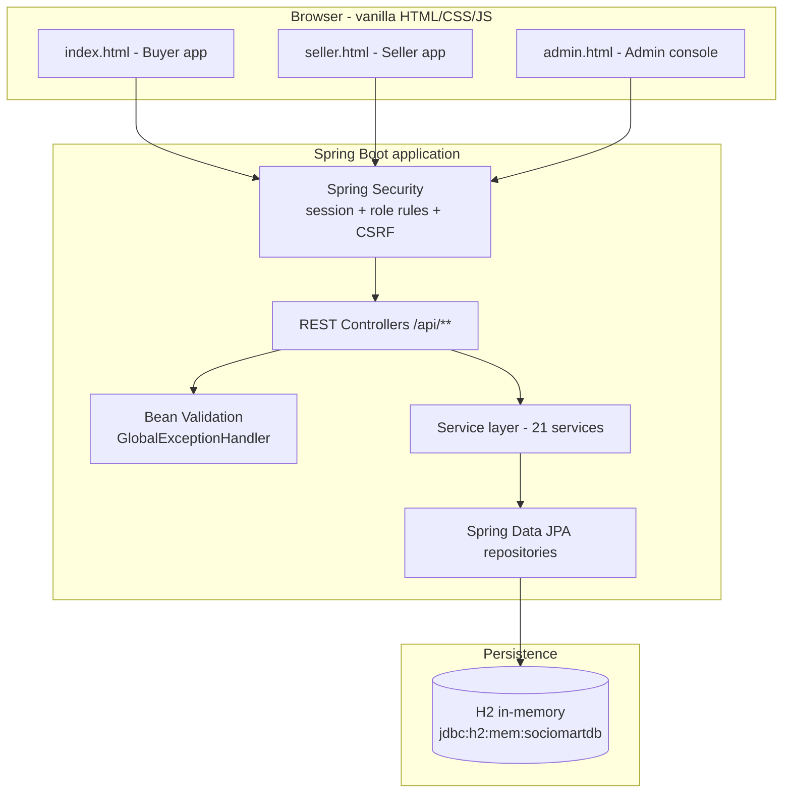
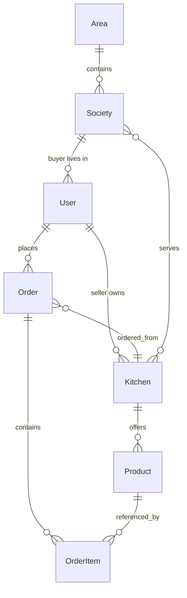
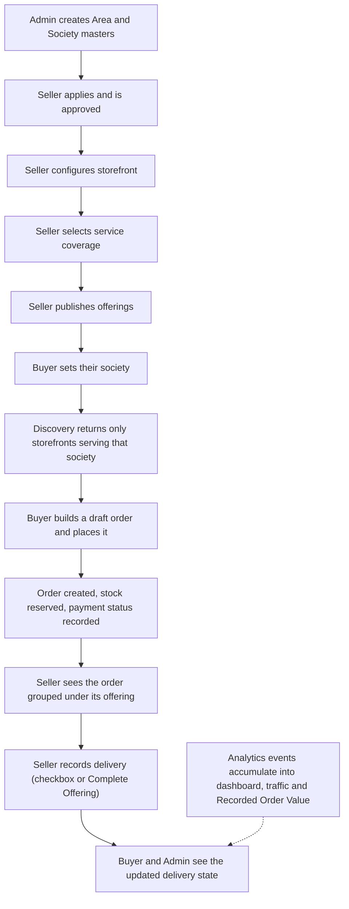

# SocioMart

**A demo-ready marketplace platform connecting buyers, home-kitchen and homemade sellers, storefronts, society-level locations, and day-to-day marketplace operations - including seller-recorded delivery tracking and an internal Admin operations console.**

## 🔗 Quick Links

| | |
|---|---|
| 🌐 **Live Demo** | https://sociomart-demo.onrender.com |
| 📚 **API Documentation** | https://sociomart-demo.onrender.com/swagger-ui/index.html |
| 💻 **GitHub Repository** | https://github.com/utkarshnikhare/my-first-spring-api |

---

## 📖 Project Overview

SocioMart is a **society-level food and homemade-goods marketplace**. The idea is simple: in an apartment
society, a handful of residents cook and sell - one runs a home kitchen, another bakes cakes. SocioMart gives
them a storefront, and gives the neighbourhood a way to find them and order.

It is deliberately **location-first**. A buyer is not shown every seller on the platform; they are shown the
storefronts that actually serve their society. An Admin defines the hierarchy first (Area -> Society), sellers
then declare which societies they cover, and buyer discovery follows from that intersection.

### Who uses it

| Role | What they do |
|---|---|
| **Buyer** | Sets their society, browses eligible storefronts, places orders, tracks payment and delivery state |
| **Seller** | Runs a storefront (home kitchen and/or homemade), publishes offerings, manages orders, records delivery |
| **Admin** | Approves sellers, manages buyers and orders, watches analytics and Recorded Order Value, keeps the audit trail |

### The three applications

SocioMart ships **three separate single-page applications**, each a distinct static page talking to its own API:

| Page | Purpose |
|---|---|
| `index.html` | **Buyer app** - discovery, cart, checkout, orders |
| `seller.html` | **Seller app** - storefront, offerings, orders, **delivery tracking** |
| `admin.html` | **Admin console** - an operations console, not a debug dashboard |

---

## ✨ Main Features

### 🛒 Buyer
- **Location-based discovery** - select your society and only eligible storefronts appear
- **Storefront / kitchen browsing** - offerings split into *Available Today* and *Pre-order*
- **Offering detail** - price, quantity limits, cut-off times, pre-order date/slot selection
- **Cart and checkout** - draft order, buyer details, payment-status selection, place order
- **Order history** - active and past orders with payment and delivery status
- **Delivery status visibility** - read-only; the buyer sees the seller's record, never sets it
- **Favourites**, **homemade enquiries**, **notifications**

### 🏪 Seller
- **Storefront management** - name, society, building, social links, availability toggle
- **Service coverage** - choose which societies the storefront serves
- **Offerings / items** - create, edit, sold-out, pause/resume, republish history
- **Saved templates & quick posts** - publish repeat offerings quickly
- **Orders** - grouped **offering -> customer orders**, with per-customer drill-down
- **Payment information** - record whether an order is paid
- **Delivery tracking** - see the dedicated section below

### 🛠️ Admin console
- **Dashboard** - Traffic, Orders, Recorded Order Value, Pending Approvals, Buyers, Sellers, Attention Needed, Recent Orders, Pending Actions
- **Seller management** - approval workflow, storefronts, coverage, status controls
- **Buyer management** - search, profile, location, orders, account status, support notes
- **Orders** - full list with filters and per-order history
- **Analytics** - traffic, storefront/offering views, seller performance, Area/Society/seller breakdown
- **Areas & Societies** - master data, enable/disable, usage counts
- **Exports** - Orders, Sellers, Buyers, Analytics (CSV)
- **Retention** - configurable order-retention window with a guarded purge
- **Attention items & audit log**

---

## 🚚 Seller Delivery Tracking

Delivery in SocioMart is **explicitly recorded by the seller**. Nothing is inferred from time, order age,
readiness, or payment. If nobody ticks the box, the order is *not delivered*.

**How it works**

1. Delivery state lives on the **existing `Order`** record - there is no separate delivery table or
   separate delivery app.
2. Every active order shows a **Delivered checkbox**. It **auto-saves** on change.
3. **Unchecked -> `NOT_DELIVERED`. Checked -> `DELIVERED`.** Ticking it stores a server-side
   `delivered_at` timestamp; unticking it clears the timestamp and returns the order to `NOT_DELIVERED`.
4. State **persists to the database** - it survives a page reload and a session/login refresh.

**Seller Orders is grouped offering -> customer orders.** On top of that grouping there are **three
independent, combinable filters**:

| Filter | Values |
|---|---|
| **Society** | the buyer society an order belongs to |
| **Payment** | payment status |
| **Delivery** | All · Delivered · Not delivered |

Any combination of the three can be applied at once.

**Delivery progress**

At the offering level the seller sees **delivered / total** and **remaining**. **Cancelled orders are
excluded from both the total and the remaining count**, so a cancelled order is never treated as pending
delivery.

**Bulk delivery completion - "Complete Offering"**

An offering-level **Mark All Delivered** action completes the offering:

- it asks for **one confirmation**, and the count quoted comes from the **server's own calculation**
  (never a guess from the visible rows);
- it acts on **all active, non-cancelled orders for that offering** - not on whatever the current
  filters happen to be showing, so a filtered view can never be mistaken for the action's scope;
- it is **idempotent**: clicking twice, or a duplicate/repeated request, changes nothing extra;
- it runs in a **transaction**, so it either completes or changes nothing - a failure is never reported
  as success;
- if the call fails, the UI **rolls back and reconciles with the server** instead of showing a false success.

**Owner safety**

Delivery APIs verify seller authentication, authorisation, order ownership and offering/order
relationship. A seller **cannot** mark another seller's order as delivered by editing an ID - the seller is
taken from the session, and the order must belong to one of that seller's own storefronts. A seller with
**more than one storefront** gets independent progress and bulk scope for each one.

**Buyer side:** buyers see *Delivered* / *Not Delivered* on their orders, read-only.

**Explicitly out of scope (not implemented, by design):** GPS/live tracking, delivery-agent app,
route optimisation, delivery OTP, proof-of-delivery photo or signature, and buyer-side delivery
confirmation.

---

## 🛠️ Admin Operations Console

The Admin app is an **operations console** - built for making operational decisions, not for watching
services. Its business navigation is Dashboard, Approvals, Sellers, Buyers, Orders, Analytics,
Areas & Societies and Exports. Technical tools (Diagnose / Health / Console) exist but are not part of the
normal navigation.

### Dashboard

Real counters computed server-side over the selected window (**Today · Last 5 Days · Custom date**):

- **Traffic** - marketplace / storefront views
- **Orders**
- **Recorded Order Value** - the value of orders recorded on the marketplace. Deliberately *not* called
  "revenue": SocioMart does not process buyer payments
- **Pending Approvals**
- **Buyers** / **Sellers**
- **Attention Needed** - how many operational items are open right now
- **Recent Orders** and **Pending Actions**

### Seller management

- **Approval workflow** - Approve · Reject · **Request Changes**
- Records **approval timestamp** and the **admin actor**
- Seller detail shows identity, mobile, enabled types, **storefronts**, **service societies**,
  **traffic**, **orders**, **Recorded Order Value**, **offerings**, **support notes** and **audit history**
- **Status controls** - Pause storefront · Resume storefront · Suspend seller · **Block seller** ·
  Unblock seller · Remove storefront
- High-impact actions require a **reason**, require **confirmation**, and **preserve history**: blocking
  or removing a seller never deletes their past orders
- Sellers see an **understandable status** explaining why they are not yet approved

### Buyer management

- Search by **name, mobile, Area, Society or order ID**
- Profile/location, recent orders, payment status, delivery status, **account status** (Active / Blocked)
- **Block / Unblock** - a **reason is mandatory** and the action is **audited**
- Internal **support notes**

### Orders

Order ID, date/time, buyer, seller, storefront, Area, Society, items, quantity and value - filterable by
date, Area, Society, seller, buyer, category, payment, delivery and order status. Order detail exposes a
**status/event history** built only from timestamps the order actually stores, so a cancelled order never
claims a delivery that did not happen.

### Analytics

- **Traffic** - marketplace views, **storefront views**, **offering views**
- **Order count** and **Recorded Order Value**
- **Conversion** - orders ÷ storefront views, shown only where views are genuinely captured (never faked)
- **Sortable seller performance table**
- **Area**, **Society** and **seller** breakdowns of Recorded Order Value, derived from the same filtered
  rows as the total, so the parts reconcile with the whole
- Homemade **enquiries**

Events captured: `storefront_view`, `offering_view`, `order_placed`, `delivered`, `cancelled`,
payment-status changes, seller approval/status changes and `enquiry_submitted`.

### Areas & Societies

Admin maintains an **Area master** and a **Society master** with **stable IDs**. Areas and Societies can be
**enabled/disabled**; both report **usage counts**. Disabling never deletes and never hard-deletes a
referenced location, and **creating a new Society does not silently make it served by existing sellers** -
coverage stays an explicit seller opt-in.

### Exports

**Orders · Sellers · Buyers · Analytics**, as CSV. Exports **respect the active filters and date range**,
include **headers** and a **generation timestamp**, support **manual download**, and are **neutralised
against CSV formula injection**.

### Retention

- **Configurable `retention_days`** (default **5**), changeable at runtime with no code change or migration
- Long-lived **daily aggregates** and the **audit trail** outlive any detailed-order purge
- **Export before purge** is supported
- The destructive purge is **off by default and never runs on a schedule**. It only runs when an Admin
  deliberately arms it, confirms, gives a reason and confirms having exported. Only *closed* orders
  (delivered or cancelled) older than the window are ever removed - an order still in flight is never
  purged, however old it is.

### Attention items

Derived from real state, each linking to the screen that resolves it: pending seller approvals, changes
requested, suspended sellers, paused storefronts, blocked buyers, **accounts with an unresolved support
note**, orders not yet confirmed, and orders with payment still pending. Nothing is invented.

### Audit log

Every consequential Admin action records **who**, **what changed**, **the target account/store/order**,
**old state**, **new state**, **reason** and **timestamp**: seller approval / rejection / request changes,
storefront pause / resume / remove, seller block / unblock, buyer block / unblock, Area and Society
enable/disable, and manual operational corrections. The log is **append-only** - the Admin app has no way
to edit or delete an entry.

### Admin roles

The model supports **Area Admin** and **Super Admin**. Scope is enforced **server-side** in the service
layer; the acting Admin is resolved from the **session, never from a request parameter**, so a crafted
request cannot widen an Area Admin's scope. Super Admin retains global scope.

---

## 👥 User Roles

| Role | Main responsibilities |
|---|---|
| **Buyer** | Discover eligible sellers, browse offerings, place orders, view order and delivery status |
| **Seller** | Manage storefront and service coverage, publish offerings, manage orders, record delivery state |
| **Admin** | Operate the marketplace: approve sellers, manage sellers/buyers/orders, monitor analytics and Recorded Order Value, keep the audit trail |
| **Super Admin** | Global scope; can additionally manage Admin accounts |

---

## 🏗️ Architecture



**Request flow:** browser -> Spring Security filter chain -> controller (validates input) -> service
(owns the rules) -> repository -> H2. Responses return the same way, with a consistent error shape.

**Access control**

- Session-based authentication. `/api/admin/**` requires `ADMIN` or `SUPER_ADMIN`; `/api/superadmin/**` requires `SUPER_ADMIN`
- BCrypt password hashing
- CSRF protection via a JS-readable cookie echoed in `X-XSRF-TOKEN` (disabled in the demo profile only)
- Ownership is always re-derived server-side - client-supplied seller or owner IDs are never trusted

---

## 🧰 Tech Stack

| Layer | Technology | Purpose |
|---|---|---|
| Language | **Java 21** | Application language |
| Framework | **Spring Boot 4.1.1** | Application foundation |
| Web | **Spring Web MVC** | REST controllers, static resources |
| Security | **Spring Security** | Session auth, role rules, CSRF |
| Persistence | **Spring Data JPA / Hibernate** | Entities and repositories |
| Validation | **Jakarta Bean Validation** | Request payload validation |
| API docs | **springdoc-openapi 3.1.0** | Swagger UI and `/v3/api-docs` |
| Database | **H2 (in-memory)** | Demo persistence, re-seeded on each boot |
| Build | **Maven** (`mvnw.cmd` wrapper) | Build and dependency management |
| Frontend | **Vanilla HTML, CSS, JavaScript** | Three static apps - no UI framework |
| Tests | **JUnit 5 + Spring Security Test** | 502 automated tests |
| CI | **GitHub Actions** | `CI Build Verification` |
| Hosting | **Render** (Docker) | Live demo deployment |

> No React, Vue or Angular - the frontend is hand-written HTML/CSS/JS served as static resources.

---

## 📁 Project Structure

```text
.
├── README.md
├── render.yaml                 # Render blueprint (Docker service, autoDeploy: false)
├── Dockerfile
├── .github/workflows/ci.yml    # CI Build Verification
├── start.sh / start.cmd / start.ps1 / Makefile
└── my-first-spring-api/        # the Maven application
    ├── pom.xml
    └── src/
        ├── main/
        │   ├── java/com/example/my_first_spring_api/
        │   │   ├── controller/   # REST controllers (/api/**)
        │   │   ├── service/      # business rules (21 services)
        │   │   ├── repository/   # Spring Data JPA repositories
        │   │   ├── model/        # JPA entities and enums
        │   │   ├── dto/          # request/response DTOs
        │   │   ├── security/     # authorization filter
        │   │   └── exception/    # error types + GlobalExceptionHandler
        │   └── resources/
        │       ├── application*.properties   # default / demo / dev / prod
        │       └── static/
        │           ├── index.html   # Buyer app
        │           ├── seller.html  # Seller app
        │           ├── admin.html   # Admin console
        │           ├── css/         # styles.css, seller.css, admin.css
        │           └── js/          # app/buyer/common/seller/admin JS + config
        └── test/java/.../service/  # 63 test classes, 502 tests
```

**Important files**

| File | Why it matters |
|---|---|
| `service/AdminService.java` | Admin console logic - dashboard, filters, approvals, audit, retention, Area Admin scope |
| `service/OrderService.java` | Order lifecycle, totals, inventory and **delivery state** |
| `service/RetentionService.java` | Configurable retention window and the guarded purge |
| `static/js/admin.js` | The whole Admin console frontend |
| `static/js/seller.js` | The Seller app, including delivery filters and bulk completion |

---

## 🗃️ Domain Model

| Object | What it represents |
|---|---|
| `User` | A buyer, seller, admin or super admin - role, society/area references, approval status, block state |
| `Area` | Top-level location grouping |
| `Society` | A society inside an Area; the unit buyers identify themselves by |
| `Kitchen` | A **storefront** - seller, `SellerType` (`KITCHEN` / `HOMEMADE_PRODUCTS`), service areas, served societies |
| `Product` | An **offering** on a storefront - price, quantity limits, lifecycle state |
| `Order` | A buyer order - items, totals, payment status, order status and **delivery state** |
| `OrderItem` | A line on an order - offering, quantity and the unit price captured at order time |
| `OrderDailyAggregate` | Long-lived daily rollup that outlives any detailed-order purge |
| `AdminAuditLog` | Append-only record of every consequential Admin action |
| `AnalyticsEvent` | Traffic and lifecycle events used to compute real analytics |
| `Enquiry`, `Favourite`, `NotificationEvent`, `LedgerEvent` | Enquiries, saved stores, notifications, ledger entries |
| `PlatformSetting` | Runtime configuration such as the retention window |

Key enums: `UserRole`, `SellerApprovalStatus`, `OrderStatus`, `PaymentStatus`, `DeliveryStatus`,
`SellerType`, `EnquiryStatus`.



---

## 🔄 How the Application Works



---

## 🔌 API Overview

Full, always-current reference is in the Swagger UI link at the top. Representative endpoints:

**Authentication** (`/api/auth`, `/api/seller-app`)

| Method | Path | Purpose |
|---|---|---|
| `POST` | `/api/auth/demo-login` | Demo sign-in by mobile number |
| `GET` | `/api/auth/me` | Current session identity |
| `POST` | `/api/seller-app/demo-login` | Demo seller sign-in |

**Discovery** (public)

| Method | Path | Purpose |
|---|---|---|
| `GET` | `/api/marketplace` | Available offerings for the buyer |
| `GET` | `/api/search` | Search storefronts / offerings |
| `GET` | `/api/kitchens` | Storefront list |
| `GET` | `/api/kitchens/{name}` | Storefront by name |
| `GET` | `/api/kitchens/id/{id}` | Storefront detail with offerings |

**Buyer** (`/api/buyer`)

| Method | Path | Purpose |
|---|---|---|
| `GET` / `POST` | `/api/buyer/profile` | Read / update buyer profile and location |
| `GET` | `/api/buyer/orders` | Buyer orders with payment and delivery status |

**Seller** (`/api/seller`, `/api/seller-app`)

| Method | Path | Purpose |
|---|---|---|
| `GET` / `POST` | `/api/seller/kitchen` | Storefront read / create |
| `PUT` | `/api/seller/kitchen/{id}` | Update storefront |
| `POST` | `/api/seller/kitchen/{id}/pause` and `/resume` | Pause / resume storefront |
| `GET` | `/api/seller/coverage-options` | Societies available for coverage |
| `GET` / `POST` | `/api/seller/products` | Offerings list / create |
| `GET` | `/api/seller/orders` | Seller orders (Society / Payment / Delivery filters) |
| `POST` | `/api/seller/orders/{id}/acknowledge` | Seller confirms an order |
| `GET` | `/api/seller-app/orders/product/{productId}` | Offering to customer orders |
| `PATCH` | `/api/seller-app/orders/{orderId}/delivery-status` | **Record one order's delivery** |
| `POST` | `/api/seller-app/orders/product/{productId}/mark-all-delivered` | **Complete Offering** (bulk) |

**Admin** (`/api/admin`, role-gated)

| Method | Path | Purpose |
|---|---|---|
| `GET` | `/api/admin/dashboard?date=` | Dashboard counters for a window |
| `GET` | `/api/admin/sellers`, `/buyers`, `/orders` | Operational lists with filters |
| `GET` | `/api/admin/sellers/{id}/detail` | Full seller record |
| `POST` | `/api/admin/sellers/{id}/approve`, `/reject`, `/request-changes` | Approval workflow |
| `POST` | `/api/admin/sellers/{id}/suspend`, `/block`, `/unblock` | Seller status controls |
| `POST` | `/api/admin/sellers/{id}/support-note` | Internal support note |
| `POST` | `/api/admin/buyers/{id}/block`, `/unblock` | Buyer account control |
| `GET` | `/api/admin/orders/{id}` | Order detail including status history |
| `GET` | `/api/admin/analytics`, `/recorded-order-value` | Analytics and commercial breakdown |
| `GET` | `/api/admin/attention` | Attention / pending-action items |
| `GET` | `/api/admin/export/{domain}` | CSV export (orders / sellers / buyers / analytics) |
| `GET` / `POST` | `/api/admin/retention` | Retention window read / set |
| `POST` | `/api/admin/retention/purge-enabled`, `/purge` | Arm / run the guarded purge |
| `GET` | `/api/admin/audit-log` | Audit trail |
| `POST` | `/api/admin/areas`, `/societies` | Location master data |

**Analytics** (`/api/analytics`) - the event capture endpoint used by the apps.

---

### API Examples

**1. Discover what a buyer's society can order from**

```bash
curl "http://localhost:8081/api/marketplace?society=Sunshine%20Society"
```

**2. Record one order as delivered** (seller session required)

```bash
curl -X PATCH "http://localhost:8081/api/seller-app/orders/42/delivery-status" \
  -H "Content-Type: application/json" \
  -b "JSESSIONID=<seller-session>" \
  -H "X-XSRF-TOKEN: <csrf-token>" \
  -d '{"deliveryStatus":"DELIVERED"}'
```

**3. Complete an entire offering** (bulk) - only active, non-cancelled orders; the server returns the counts

```bash
curl -X POST "http://localhost:8081/api/seller-app/orders/product/7/mark-all-delivered" \
  -b "JSESSIONID=<seller-session>" -H "X-XSRF-TOKEN: <csrf-token>"
```

**4. Admin dashboard for a chosen window**

```bash
curl "http://localhost:8081/api/admin/dashboard?date=today" \
  -b "JSESSIONID=<admin-session>" -H "X-XSRF-TOKEN: <csrf-token>"
```

> CSRF is only enforced outside the demo profile - see [Current Demo Limitations](#️-current-demo-limitations).

---

## 🧪 Testing

The suite is the project's main safety net. Run it exactly as CI does:

```bash
cd my-first-spring-api
.\mvnw.cmd clean verify
```

**Latest verified result**

```text
Tests run: 502, Failures: 0, Errors: 0, Skipped: 0
BUILD SUCCESS
```

**Test categories** (63 test classes under `src/test/java/.../service/`)

| Area | What is covered |
|---|---|
| **Admin V1** | Dashboard counters and date windows, global filters, seller/buyer search, approvals, seller controls including block/unblock, buyer block/unblock, order filtering, Recorded Order Value and its breakdown, analytics, Areas/Societies usage, exports (filters, headers, formula-injection safety), retention guards, audit log, attention items, Area Admin authorisation boundaries |
| **Delivery V2** | Individual delivery, persistence, `delivered_at`, uncheck/reset, cancelled exclusion, bulk completion, bulk idempotency, bulk authorisation, seller ownership, multi-storefront scope, Society / Payment / Delivery filters and their combinations, buyer reflection, kitchen and homemade orders |
| **Buyer journey** | Profile round-trip, place order, inventory decrement, duplicate-submit protection, society/service-area enforcement, incomplete profile blocking |
| **Cross-cutting** | Favourites concurrency and per-buyer limits, category validation, consistent error shape, discovery coverage filtering |
| **HTTP security** | Role rules on `/api/admin/**` and `/api/superadmin/**`, CSRF behaviour |

Tests never delete demo data and never weaken an assertion to force a pass.

---

## 💻 Local Development

**Prerequisites:** JDK 21. Maven is not required - the wrapper is included.

```bash
git clone https://github.com/utkarshnikhare/my-first-spring-api.git
cd my-first-spring-api
```

**Run the app**

```bash
cd my-first-spring-api
.\mvnw.cmd spring-boot:run
```

**Test**

```bash
.\mvnw.cmd clean verify
```

**Open**

| URL | What |
|---|---|
| http://localhost:8081/ | Buyer app |
| http://localhost:8081/seller.html | Seller app |
| http://localhost:8081/admin.html | Admin console |
| http://localhost:8081/swagger-ui/index.html | API docs |
| http://localhost:8081/h2-console | H2 console (dev/demo only) |

The port defaults to **8081** and honours a `PORT` environment variable, which is what Render injects.
The database is **in-memory H2**, seeded on every boot by `DemoDataSeeder` - there is nothing to install
and no data to clean up.

### Demo access

Authentication in the demo is a **mobile-number sign-in**, not a password:

| Role | How to sign in |
|---|---|
| Buyer | Buyer app, sign in with a demo buyer mobile (for example `9876500016`) |
| Seller | Seller app, **demo sign-in** button (signs in as the seeded seller `9100000001`) |
| Admin | Admin console, sign in with `9000000001` (Super Admin) or `9000000002` (Admin) |

`POST /api/auth/demo-login` with `{"mobileNumber":"9000000001"}` does the same thing over HTTP.
These are **demo identifiers only** - they are not credentials for anything real.

> On Windows use `.\mvnw.cmd`; on macOS/Linux use `./mvnw`.

---

## 📖 Demo Flow

A realistic ten-minute walkthrough.

**1 · Prepare the location (Admin)** - Admin console, **Areas & Societies**, create an Area and a Society.
Creating a Society does **not** make it served by existing sellers; coverage is always an explicit seller
opt-in.

**2 · Approve a seller (Admin)** - **Approvals**, then **Approve** (or **Request Changes**). The seller record
now shows an approval timestamp and the acting admin.

**3 · Configure the storefront (Seller)** - set name, society, building and social links; toggle availability.

**4 · Set service coverage (Seller)** - choose which societies the storefront serves. This is what makes it
discoverable to the right buyers.

**5 · Publish offerings (Seller)** - create an offering with a price and quantity limit. It appears under
*Available Today*, or under *Pre-order* with its cut-off.

**6 · Discover a storefront (Buyer)** - sign in as a buyer and set your society. Only storefronts serving that
society appear. Open one and browse its offerings.

**7 · Place the order (Buyer)** - add to order, checkout, choose a payment status, confirm. Stock is reserved
for the offering.

**8 · See the order (Seller)** - Seller app, **Orders**. The order appears grouped under its offering, with a
customer drill-down.

**9 · Filter and record delivery (Seller)** - use the **Society**, **Payment** and **Delivery** filters
together. Tick **Delivered** and it auto-saves; refresh and it is still there. Try **Complete Offering** and
notice the confirmation count comes from the server.

**10 · Confirm reflection (Buyer + Admin)** - the buyer sees the order as **Delivered**; the Admin console shows
the same state plus the order history.

**11 · Review operations (Admin)** - Dashboard, then **Analytics** for views, conversion and seller
performance, then **Exports** to download the filtered view, then **Audit log** to see every action taken.

---

## 🚀 Deployment

**How a change reaches production**

```text
feature branch -> push -> pull request -> GitHub Actions (CI) -> pass -> merge to main -> manual Render deploy -> live demo
```

**CI - GitHub Actions**

| | |
|---|---|
| Workflow | `CI Build Verification` (`.github/workflows/ci.yml`) |
| Job | `build` |
| Trigger | push to `main`, pull request to `main`, manual dispatch |
| Command | `mvn -B clean verify` (inside `my-first-spring-api`) |
| JDK | Temurin 21, with the Maven cache |
| Gate | Also asserts `target/classes` and a packaged jar exist |

CI is the **authoritative gate** - do not merge on a red build.

**Render - `render.yaml`**

| | |
|---|---|
| Service | `sociomart-demo` (the existing service; do not create another) |
| Runtime | Docker (`./Dockerfile`) |
| Plan | free |
| Health check | `/api/kitchens` |
| Profile | `SPRING_PROFILES_ACTIVE=demo` |
| Port | Render injects `PORT`; the app binds `${PORT:8081}` |
| **`autoDeploy`** | **`false`** |

**`autoDeploy` is deliberately disabled.** Render previously deployed every pushed commit regardless of the
CI result, so a failing test could still reach production. It is now off so a deploy is an explicit action
taken **after** CI has passed.

**Deploying manually**

Merging to `main` does **not** deploy. To deploy:

1. Confirm `main` CI is green.
2. Open the Render dashboard and the existing `sociomart-demo` service.
3. Choose **Manual Deploy** on the latest `main` commit.
4. Wait for it to go **Live**, then verify the live site.

CI does not verify the live deployment, so this manual step matters.

---

## ⚠️ Current Demo Limitations

This is a **demo**, and this section will not pretend otherwise.

| Area | Current demo | Future production |
|---|---|---|
| **Authentication** | Mobile-number demo sign-in; no password or OTP. CSRF disabled in the demo profile. H2 console exposed in demo/dev | Real authentication (password/OTP), CSRF always on, console removed |
| **Database** | In-memory **H2**, re-seeded on every boot - **all data is lost on restart** | Managed database with schema migrations |
| **Payments** | Payment **status** is recorded by the seller; **no payment gateway** is integrated and no money moves | Real payment integration |
| **Hosting** | Render **free tier** - sleeps after ~15 min idle, so the first request can take 60-90 s; single instance, no SLA | Production infrastructure |
| **Deployment** | `autoDeploy: false`; deploys are manual | Automated deploy gated on CI |
| **Operations** | No rate limiting, monitoring, alerting or centralised logging | Standard production observability |

Delivery, by design, is **seller-recorded only** - no GPS, delivery-agent app, route optimisation, delivery
OTP, or proof-of-delivery photo/signature.

---

## 🔮 Future Production Work

Not implemented - listed so the demo's limits stay explicit.

- **Authentication** - password or OTP login replacing demo mobile sign-in; enforce CSRF outside demo
- **Persistence** - a managed relational database with migrations (Flyway/Liquibase); today the schema is
  created by Hibernate `ddl-auto`
- **Security hardening** - secret management, rate limiting, account lockout, security headers
- **Operations** - structured logging, metrics, health checks, alerting
- **Deployment** - auto-deploy gated on green CI, or a release pipeline with rollbacks
- **Payments** - integrate a real payment gateway (statuses are already modelled)

---

## 🧰 Troubleshooting

| Problem | Cause / fix |
|---|---|
| **`mvnw.cmd` not recognised** | Use `.\mvnw.cmd` in PowerShell (or `./mvnw` on macOS/Linux) - it is a relative path |
| **Wrong Java version** | Requires **JDK 21**. Check with `java -version` |
| **Port 8081 already in use** | Stop the other process, or run with `--server.port=8082` |
| **Live demo slow / first request hangs** | Expected - the Render free tier sleeps after ~15 min idle and needs 60-90 s to wake |
| **Live demo looks stale after a merge** | Merging does **not** deploy (`autoDeploy: false`). Trigger a manual deploy from the Render dashboard |
| **Frontend looks stale after a deploy** | Hard-reload or clear cache (`Ctrl+Shift+R`) |
| **403 Forbidden on POST/PATCH** | Missing or wrong `X-XSRF-TOKEN`. Outside the demo profile CSRF is enforced; `common.js` handles it for the bundled UI |
| **401 Unauthorized** | Session expired or wrong role. `/api/admin/**` needs ADMIN or SUPER_ADMIN |
| **All data gone after a restart** | Expected - H2 is in-memory and re-seeded on every boot |
| **Tests fail locally but pass in CI** | Usually a stale `target/` - run `.\mvnw.cmd clean verify` (the `clean` matters) |
| **Swagger UI 404** | Use `/swagger-ui/index.html`; `/swagger-ui.html` redirects there |

---

## 📌 Latest Release - Current Demo

**Admin V1 and Seller Delivery V2.**

- **Admin operations console** - compact dashboard with real Traffic, Orders, Recorded Order Value,
  Pending Approvals, Buyers, Sellers and Attention Needed cards; Today / Last 5 Days / Custom windows
- **Seller Delivery V2** - per-order Delivered checkbox with persistence, three combinable filters
  (Society / Payment / Delivery), offering-level progress, idempotent "Complete Offering" bulk action
- **Multi-storefront delivery** - delivery scope resolves from the opened offering, so a seller with more than
  one storefront gets correct, independent progress
- **Analytics** - storefront and offering views are genuinely captured; views are counted per storefront
  rather than multiplied by order volume; conversion is shown only where views exist
- **Seller management** - approval workflow, Block/Unblock seller, storefront pause/resume/remove, support notes
- **Buyer management** - search by name/mobile/Area/Society/order ID, block/unblock with a mandatory reason
- **Orders** - full filters and a per-order status history that never invents an event
- **Areas & Societies** - master data, enable/disable, usage counts, stable IDs
- **Exports** - Orders, Sellers, Buyers, Analytics; filter-aware and formula-injection safe
- **Retention** - configurable window with a guarded, off-by-default, export-before-purge flow
- **Audit and attention** - append-only audit trail and an attention model derived from real state
- **Area Admin / Super Admin** - enforced server-side, not in the UI
- **Documentation** - this README

**502 tests · 0 failures · 0 errors · BUILD SUCCESS**

---

## 📄 License

See the repository for licensing terms.
